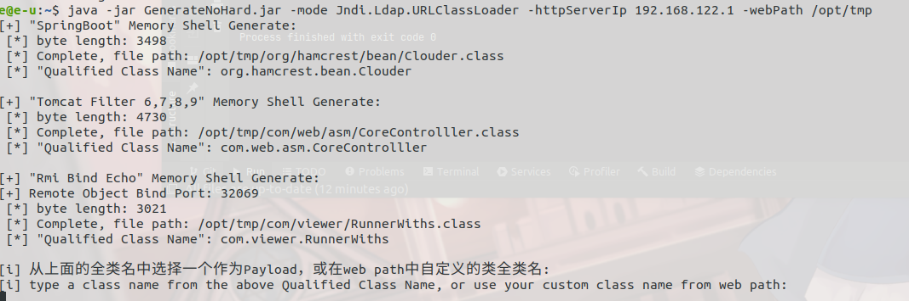
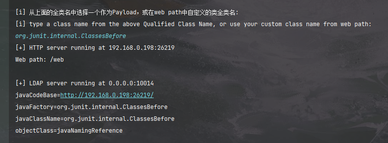

GenerateNoHard


本工具的定位是快速生成Java安全相关的Payload，如内存马、反序列化链、JNDI url、Fastjson等，动态生成相关Payload，并附带相应的文档。文档中会将链路的关键函数、注意事项和小细节罗列出来，方便快速唤醒记忆。但现在也就只有一个SpringBoot和Tomcat的内存马，以后慢慢更新吧233。


产生要写这个工具的想法是在之前做CTF题和复现漏洞的时候，当需要内存马、JNDI url等payload时，总要复习一遍笔记，重新调一调过一遍流程才会构造。效率十分低下。毕竟都是已经学过一遍调过好几遍的东西，还得这样浪费时间重调，十分不友好。虽然学习时也有笔记，但是过于冗杂，只适合初学看，已经了解过的再看容易抓不住重点。所以我便想写一个payload生成工具的同时附带文档，文档中提示关键函数以方便复习时断点调试，记录细节以免重蹈覆辙。


不过本人最近要去考毕业要求证了，还要准备专插本的东西，，所以这段时间没空更新这个项目了。先放到github存着先吧。


**项目结构**

```shell
- com
  - dto
    - ClassDto.java - 存放类字节码
  - generate
  	- GenerateAttack.java - 动态生成类字节码
  	- GenerateServlet.java - 生成恶意命令
  	- Jndi.java - 启动JNDI服务
  	- PostGenerate.java - 生成指定格式的Payload
  	- RmiBind.java - 生成RMI bind
  	- Utils.java - 工具类，目前主要是用来生成随机名
  - server
  	- HttpServer.java - HTTP服务
  	- LdapServer.java - Ldap服务
  - utils
  	- Bcel.java - 就是那个Bcel，只不过copy过来了一份，免得有些jdk版本没有
  Main.java - 主类
  Usage.java - 用法类
下面都是动态生成恶意类的模板，顾名思义即可
xxxx.temp
.....
```


这个项目结构后期肯定要优化的，有点乱233。

**需要额外注意的是，为了兼容各个不同版本的中间件和jdk，项目采用的是动态加载依赖jar包的方式进行Payload生成，而依赖jar包放置在项目外的`jars`目录下**


**已支持的Payload**

registerHandler 方式注入SpringBoot内存马

registerMapping 方式注入SpringBoot内存马

Tomcat 6,7,8,9 Filter 通用内存马

Rmi Bind回显内存马


Jndi注入 - URLClassLoader


**特点：**

* 内存马的类名、函数名等均通过随机可读字符串生成
* 通过用try/catch写内存马逻辑，缩小不同版本通用Payload的体积


**Todo**

- [ ] tomcat valve websocket 内存马

- [ ] 可选命令执行或其他

- [ ] JNDI unboundid 接受外带数据（log4shell）

* [ ] spel、ongl、ScriptEngineManager 语句构造


**关于文档**

文档最近确实没空写233，待我考完证就先把文档补了。


**免责声明**

该工具仅用于安全自查检测

由于传播、利用此工具所提供的信息而造成的任何直接或者间接的后果及损失，均由使用者本人负责，作者不为此承担任何责任。

本人拥有对此工具的修改和解释权。未经网络安全部门及相关部门允许，不得善自使用本工具进行任何攻击活动，不得以任何方式将其用于商业目的。


# 打包
**目前项目支持Maven打包啦~，只需要在项目根目录下执行`mvn clean package`即可**

依赖Jar放在`jars`目录下，本工具需要依赖这些Jar包生成Payload

# 用法

`-help` 列出帮助选项


**简单示例：**


生成Base64格式，以registerHandler方式注入的SpringBoot内存马

`-url /evilUrl -mode SpringBoot.registerHandler -commandArg cmd -encode base64`


生成Base64格式，以registerHandler方式注入的SpringBoot内存马。并指定请求头的连接密码为`evil=attack`

`-url /evilUrl -mode SpringBoot.registerHandler -commandArg cmd -encode base64 -headerPassword evil=attack`


生成Filter形式的Tomcat内存马class文件，写入到/class目录下。

`-url /evilUrl -mode Tomcat.6789.Filter -commandArg cmd -encode classFile -filePath /class`


生成的内存马还是需要目标存在诸如defineClass、TemplatesImpl这种能执行任意代码的场景下生效。后续尝试加上用CC的invoke method、或者spel表达式等方式注入的生成器。


JNDI注入的话会灵活些。目前只支持用URLClassLoader方式加载恶意class。

而其中，可选使用本项目生成的内存马作为恶意class，也可自定义一个恶意class


启动恶意LDAP服务器和Web服务器，指定web路径为`/web`。

`-mode Jndi.Ldap.URLClassLoader -webPath /web -commandArg cmd`

此时会出现选项



这里列出了三个项目内置的内存马。而参数中的`-commandArg`就是为SpringBoot和Tomcat Filter内存马服务的。

若要使用内存马，就复制列出来的全类名，输入到控制台

若不想用这三个内存马，可以自己将恶意类放置到web path中。然后再回到控制台输入恶意类的**全类名**

注意只能绑定一个恶意类，也许能绑定多个？后期我在喵喵。


输入完成后，恶意LDAP服务正式开启




可选的encode模式：

* classFile (要和`-filePath`一起使用)
* base64
* hex
* bytes
* bcel
